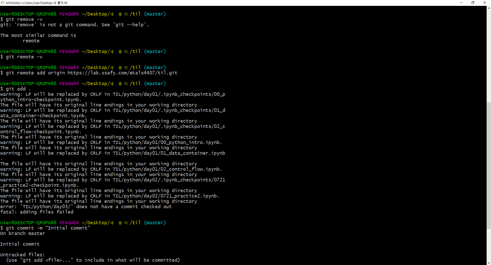

# 0. Git 사용법

> 깃...
>
> 멋쟁이 사자처럼 활동 할 때 사용해 봤잖아???
>
> 운영체제 과제하면서 리눅스 명렁어도 좀 써보고 옛날 기억도 있어서 검은 터미널 창에 대한 두려움은 좀 사라졌어도 여전히 깃 사용하는 방법이 서투르다..
>
> 맨날 터미널 꼬이구...거절당하고...clone과 remote add를 반복...ㅎ...
>
> 이번 기회에 확실히 명령어 정리하고 가자!

### 다또깃????

~~다민이 또 깃?~_~~~


### 나 : 하하하하하하하하하하하 뭐 어때????? 그래서 만든 페이지잖아???하하하하하하


### 깃이란 무엇인가?


**깃허브**(GitHub, /'ɡɪtˌhʌb/, 원래 이름: Logical Awesome LLC)[[1\]](https://ko.wikipedia.org/wiki/깃허브#cite_note-1)는 분산 버전 관리 툴인 [깃(Git)](https://ko.wikipedia.org/wiki/깃_(소프트웨어))을 사용하는 프로젝트를 지원하는 웹호스팅 서비스이다. [루비 온 레일스](https://ko.wikipedia.org/wiki/루비_온_레일스)로 작성되었다. GitHub는 영리적인 서비스와 오픈소스를 위한 무상 서비스를 모두 제공한다.

~~그럼 git은 뭐고 github는 뭔데?~~

<u> [깃(Git)](https://ko.wikipedia.org/wiki/깃_(소프트웨어))이 텍스트 명령어 입력 방식인데 반해, 깃허브는 화려한 그래픽 유저 인터페이스(GUI)</u>를 제공한다. 


그래 정의는 그렇다 치고 버전관리, 협업프로그램인건 익히 들어 알고 있었다.

그럼 이 유용한 걸 <u>어떻게 유용하게 쓸것인가? 이게 괭장히 중요하다 이거거든요</u>


그럼 이 많은 명령어들이 어떤 원리로 올라가는지 그림으로 한 번 보자!


- 내가 작업한 공간 : working Directory 
- 일단 이 정도 수준으로 프로젝트 올릴게~스탠바이 전에 사진 한 번 찍자 ?~ : staging Area
- 최종 프로젝트 올린다아~~~ : Repository

#### 근데 놀라운건 <u>저 3개의 공간이 모두 내 컴퓨터 영역(local)이라는 것</u>이다.

<u>저렇게 아무리 열심히 해도 push해 주지 않으면 git에 올라가지 못한다.</u>

### git commit 후에 반드시 push를 해줘야 git 에 올라갈 수 있다. 그래야 잔디도 심어지고 git 서버에 내 프로젝트가 등록이 된다.

 자세한 명령어 코드는 아래를 참고 하자~


### +삽질전에 미리 중요

### 너 지금 어디서 작업하고 올리는거여??? 올리고 싶은 폴더 내에서 올려야 돼 

### 예를 들어 디렉토리 하나만 올리고 싶으면 그 파일 있는 폴더에서 진행해되고 디렉토리가 매우 많은 경우 어떤 상위 폴더에서 작업 해야하는지 정신 똑바로 차려야 빈 폴더만 안올라간다.


## 1. 첫 디렉토리에 깃을 사용한다면?

> 처음 바탕화면에 디렉토리를 만들고 작업을 진행했다. 
>
> 그렇다면 이걸 올려서 버전 관리를 해야할 것 아닌가?
>
> 이걸 깃에 어떻게 올려줄것인가? 주소 등록은? 어떤 명령어를 사용해서? 
>
> 워워...일단 진정하고 차근차근 해보자.


옛날에 나였다면 우어어엉 어려워ㅜㅠㅠㅠㅜㅠㅜ몰라...난 바보야 맨날 까먹어ㅠㅠㅠ포기할까?

했을텐데 수많은 에러를 경험해 본 나로선 이게 뭐 내 잘못인가?ㅡㅡ 못 알아 먹는 컴퓨터 잘못이지라고 뻔뻔해 질 수 있다 ㅋㅋㅋㅋ~~(맞잖아?)~~


### 0. 리눅스 명령어

> 현재의 나는 과거의 내가 어떻게 리눅스 명령어를 기억했을까..? 하겠지? 
>
> 혹시 모르니까 터미널 창에서 버벅 거리지 않도록 리눅스 명령어 부터 정리해보겠다.

```bash
# 현재 디렉토리의 상위폴더로 이동
$ cd ..
# 현재 디렉토리의 하위 폴더명으로 이동
$ cd 폴더명.확장자
# 현재 디렉토리의 파일 목록 
$ ls 
# 현재 위치에서 코드 에디터 실행하기(VScode)
$ code .
# 이건 쓸지 모르지만 현재 디렉토리에 .c파일이나 .py파일을 만들고 싶다면
$ vi example.py
```

터미널창에 입력하는 다양한 입력 명령어는 구글링하면 금방 찾을 수 있다.

(아래에 링크를 참조 하겠다, 포스팅 주인이 이 글을 지우지 않는다면 평생 볼 수있겠찌?)

[리눅스 기본 명령어](https://itholic.github.io/linux-basic-command/)


#### 0.1  내 컴퓨터에 깃아이디 등록하기

만약 컴퓨터로 깃을 처음 설치하고 올리는 거라면!

```bash
$ git config --global user.name "유저명"
$ git config --global user.email 이메일@example.com
```

#### 내 깃 정보는 등록해 줘야 한다! 내가 누군지 알려줘야 내 아이디 찾아서 올려주짛ㅎㅎㅎㅎㅎ


### 1. git init (git 초기화하기)

<u>프로젝트에 깃을 적용하겠다는 명령어다.</u>

<u>이 명령어를 실행하면 폴더목록에 .git이 추가 된다.</u>

숨김폴더로 생성되어 컴퓨터 설정에 따라 보이지 않을 수 있다. (그럴땐 ls -a명령어로 찾아보기)

```bash
$ git init
```

*ok ok~그래 내가 이 프로젝트를 깃을 적용할 건데 프로젝트 상태가 어떤지 확인은 해봐야지..?*


### 2. git status (git 상태보기)

 현재 프로젝트 변경사항을 확인하는 명령이다. 

코드 수정이 있는 경우 확인하면 어쩌구 저쩌구 나올것이다.

```bash
$ git status
```

*그래 너 수정한 파일있고 뭐 지웠고 블라블라~*


### 3. git 원격저장소와 연동하기 

스테이징한 파일들을 저장소로 넘겨보내는 명령어 이다.

그럼 어디 저장소로 넘겨 줄건데??? 깃 어디 프로젝트에 넘겨 줄건데??

<u>이를 위해 주소가 필요하다.</u>

```bash
$ git remote add origin https:주소~
```

- git : 깃프로그램아~
- remote : 원격저장소기능
- add : 추가기능 
- origin : 별명은 origin이고 
- 뒤에는 실제주소다~

정리하면 

#### "깃프로그램아~ 원격저장소기능 중에 추가기능을 사용할 건데 주소 너무 기니까 별명으로 부를게 사실 얘 진짜 이름은 주소~야!"

origin이라는 이름으로 리모트 저장소가 등록됐다는 의미이다!

```bash
# 원격저장소 URL확인 
$ git remote -v 
```

이 명령어를 통해 단축이름 origin과 원격저장소의 URL을 확인할 수 있다. 


#### 그렇다면 origin으로 등록되어있는 저장소를 삭제하려면?

```bash
$ git remote remove origin
# 또는
$ git remote rm origin
```


### 4. git commit (git staging하기)

스테이지는 저장소 가기 전에 잠시 머무리는 임시저장소라고 생각하자.

저장누르면 한 번에 저장소로 가면 되지 뭐하러 이렇게 복잡하게 하나 라고 생각하겠지만 사회생활이라는게 겪어보면 다 이유가 있는 것처럼 이것도 다 이유가 있다.(뭔소리야)

```bash
$ git commit
```

commit 할 때 메세지도 남기고 싶다면 아래 명령어를 통해 메세지도 같이 입력해서 내보내자.

```bash
$ git commit -m "나는 남긴다, 메세지, 여기에"
```

내가 commit 했던 내용이 잘 올라갔는지 확인도 해봐라!

```bash
$ git log 
```

또 다중으로 보이는 git log를 간단하게 볼 수 있는 방법도 있다.

```bash 
$ git log --oneline 
```


### 4.1 git commit 에 대한 명령어

commit은 굉장히 주의해서 올려야 한다.(버전관리를 위해 굉장히 중요하다.)

그런데 commit 메세지를 수정하고 싶다면?

- 커밋 메세지 수정 (마지막 commit만 수정 가능) 

  이 부분의 경우 터미널 창에 접근해야 하는 경우라 한 번 꼬이면 버전관리 log 까지 노답 삼형제가 되므로 최대한 commit은 신중하게 올린다. 

```bash
$ git commit --amend 
```


### 5.  git push 

마지막으로 로컬 저장소에 있는 파일을 원격저장소로 push하면 된다!

그러면 git에 올라갔을 것이다~

```bash
$ git push origin master
```


## 2. 다른 컴퓨터에서 git에 올라온 레파지토리를 다운 받는경우

> 오늘 교육장에서 도착하자마자 잘 고쳐진 git 파일 그냥 git clone으로 다운만 받았지 pull해주지 않았잖아..?
>
> 그래서 또 오늘 git push origin master가 되지 않았지...또 찡찡찡....하지만 이젠 git 마스터가 될 길이 멀지 않았다...깃...부셔준다...복수한다...

### 제발 git pull origin master 좀 해라~~


### 01. 다른 컴퓨터에서 깃에 올라간 파일을 다운 받는 상황이라면? 

### (이때 개인프로젝트를 진행 하는 상태)

- 새로운 맴버가 clone하기 

  #### 새로운 협업자는 원격저장소의 소스코드를 clone(복제)하여 --> 소스트리에서 clone Repository를 통해 새로운 로컬 저장소(다른 컴퓨터)에 다운로드 하게 된다. 


- git의 소스코드를 지역저장소로 가져오기

```bash
$ git clone https://주소~
```


- 원격 저장소와 지역 저장소를 동기화 시켜 줘야 한다. 

#### 그렇다면 왜?????? 모든 저장소들은 버전에 대한 모든 정보를 각자 가지고 있다. 

#### 여러대의 컴퓨터에서 작업을 할 때 버전에 대한 정보를 동기화 시켜줘야한다. 

#### 역사가 같아야 버전관리가 된다. 무조건 git log 맞춰줘여한다.->git pull

```bash
$ git pull 
```


- 작업 후 과정은 어렵지 않게 진행 할 수 있다. 

```bash
$ git pull
$ git add .
$ git commit -m "message"
$ git push origin master
```

#### 따라서 우리는 git log (깃의 역사, 버전)을 다른 컴퓨터에서 작업할 때 지켜줘야 한다. 

### 잊지 마라. git pull 그리구 git push...


## 3. 두번째 push라면?

> 첫번째 디렉토리를 깃에 등록하고 push해 봤다면 그 뒤에 명령어는 보다 쉽고 간단하다.
>
> 하지만! 여기서 엄청 꼬일 수 있다 하하하하하
>
> 여기서 꼬여서 삽질 엄청 했었다 ㅎ

### 내가 push했던 곳에서 push해야 안꼬인다!!!!!!!!!


수없이 clone과 삭제와 git push를 진행했던...지난날을 돌이켜 보아라..

분명 이렇게 적어 놓고도 에러 페이지를 만날 것이다..

그럴 땐 또 와서 여기에 적어 놓고 가겠다 하하하하하


두번째 push라면 아래와 같은 명령어를 작성하면 될것이다. 

### 오타가 없거나 push했던 공간이 제대로 맞다면..

```bash
# 지금 프로젝트가 얼마나 바뀌었는지 상태를 보여줌 
$ git status
# 바뀐 상태를 add .(전부 더해줘)해 준다.
$ git add .
# 바뀐 상태가 어떻게 바뀌었는데 message를 넣어서 구별한다.
$ git commit -m "동사 목적어"
# 이미 등록해 놓은 origin 주소 사용해서 push
$ git push origin master

```

- git status : untraked file, git이 버전 관리를 하고 있지 않은 파일들을 보여준다.(빨간색)
- git add : untracked file 추척(초록색) / git add . 뒤에 점을 찍으면 git status의 빨간색 항목들을 모두 새로 추적한다. 
- 또 changes not add staged ~~ 이 에러창이 뜬다면? -> git add . 해주라는 의미이다.


- 또 add작업 하기 전에 과거의 기록과 현재의 기록이 얼마나 다른지 바뀐 수정사항을 보여주는 명령어도 있다. 

  터미널 상태에서 바뀐 부분 비교하기 

```bash
$ git diff 
```


- 깃 add 취소가능  (정확한 명령어는 git status 에서 확인이 가능하다. ) 

   : to discard changes in working directory 

```bash
$ git restore <file>
```

### 만약에 원격저장소(git)와 로컬저장소(내PC)의 파일 내용 및 git log가 맞지 않으면 에러가 나면서 push되지 않을수도 있다.(그거 나야, 맨날 나야) 그럴 경우에는 아래 명령어를 실행한다.

### (로컬은 비어있고, 원격저장소에만 파일이 있다고 가정했을 때)

```bash
$ git pull --allow-unrelated-histories origin master
$ git push -u origin master
```

- git pull : 원격저장소에 있는 파일들을 받아온다 . 많은 옵션들이 있는데, --all-unrelated-histories는 지금 로컬과는 별개로 진행됐던 원격 저장소의 내영들을 가져온다는 의미이다.

~~이건 조만간 한 번 스윽~써 봐야겠다~~


## 4. Git 아이디가 2개 이상이라면 내 로컬에서 확인해야할 항목 

지금과 같이 git ID를 두개 이상 쓰고 있는 상황이라면 내 로컬에서 로그인 한 아이디가 뭔지 수시로 확인해야 할 필요가 있다.

- config 옵션 전부를 보고 싶을 때, 터미널창에 검색한다. 

```shell
git config --list
```

- 현재 내가 로컬에서 로그인 되어 있는 정보를 확인 하는 방법

```shell
git config user.name
git config user.email
```

- user.name과 user.email을 바꾸는 방법

```shell
git config --global user.name "이름"
git config --global user.email "anotherID@gmail.com"
```


## 5. 에러페이지(조만간 또 올림^^ 걱정마 ㅎㅎ)

### 01. 하위폴더에 .git이 있는 경우 



#### 안녕 클레오파트라~ 세상에서 제일 가는 포테이토칩

### 2020.07.27 내가 또 올거라고 했지? ㅎㅎㅎㅎㅎㅎㅎ

#### 이번에도 꼬여서 두 번 다시 안꼬이려고 왔다....

#### 자꾸 이런식으로 꼬이는 이유는 가장 상위 폴더에만 있어야 하는 

```bash 
$ git init
```

#### 으로 만든 `.git`파일이 하위 폴더에 있으면 이런 에러가 난다. 

그래서 해결 방법은 간단하다. 폴더를 돌아니면서 올리려는 폴더의 상위 폴더 이외에 다른 곳에서 

.git이 발견되면 죽이는거다.

```bash
# .git 폴더가 있는지 찾기
$ ls -a
# 하위 폴더에 .git이 있다면 지우기
$ rm -rf .git
# 여러 폴더를 돌아다니면서 .git 파일 찾기
$ cd ..
$ ls -a 
# 무한반복 후 .git이 있는 가장 상위폴더에서 git add . 해주기
```


### 02 . 커밋 기록이 로컬기록과 깃기록이 다른 경우 (역사가 다른 경우)

민교쌤 :  그래서 커밋 기록이 로컬에 있는거랑 깃랩에 있는거랑 전혀 달라요

​			 역사가 다르다고 보통 표현하는데 이런 경우는 그냥 원격저장소를 날려버리고 새로 만드는 게 깔끔합니다


#### .git 폴더를 지우고 다시 만들었다면 로컬에 있는 기록과 깃에 있는 기록이 달라서 발생하는 push에러이다.

#### 이럴땐 깃에서 레파지토리를 지우고 다시 만들어 주는 것이 해결 방법이다.....

### ~~함부로 .git을 지우지 말자...특히 프로젝트 진행 되고 나서는 버전관리를 위해 더더욱...~~

- 이거는 github

```
git -> 진행중인 프로젝트 폴더 -> setting -> 맨마지막 delete부분에 메시지 입력 후 지워......
```

- 이거는 gitlab

```python
프로젝트 왼쪽하단 settings -> general -> advanced -> remove 
```


### 03. 또 에러 페이지 뜨면 기록하러 올게~_~


## 4. 느낀점

> 알다가도 모를 깃......
>
> 진짜 편하고 좋아, 안보이는 USB같이? 용량 걱정 없이 어디서든 download가능 하고 다른 사람한테 굳이 보내주지 않아도 내가 member로 등록 시켜주기만 하면 또 같이 볼 수 있고
>
> 근데 한 번 꼬이고 마감 시간 다가오면 그렇게 검은 터미널 창이 미울 수 없다 ㅎㅎㅎ


### 마음의 여유? 프로젝트 경험에 대한 실력 향상? 그런거 업써!!!!!!!!!!!!!!!!!!!!!!!!!!

여전히 나는 삽질중이고 남들보다 늦는것 같지만......안 똑똑이ㅠㅠㅠ

그렇지만 다른 사람들보다 에러 경험이 많아서 덜 겁먹을 수 있다는게 다행이다. 하하하하하하

긍정적으로 생각하자.

옛날 같았으면 질문하는 것도 어려워 하고 엄청 눈치보면서 나만 못한다고 자괴감 들어 했을텐데

주위에 좋은 사람들이 많이 있다는 거에 감사하자 ㅎㅎ

또 뭐 실수 하면 어때? 또 실수 할건뎈ㅋㅋㅋㅋㅋㅋㅋㅋㅋㅋㅋㅋㅋㅋㅋㅋㅋ

갠차나~갠차나~ 여유~여유

 

### 언젠간 내 스스로 코드를 짜고 인정받는 개린이가 되겠찌!!!!!!!!!!!!!!!!!!!!!!!!!!!!!!!!!!!!!!!!!!!!!

### 포기하는 순간 끝이야!!!!!!!!!!!!!!다시 이러나!!!!!!!!뿌뿌뿌~~~~